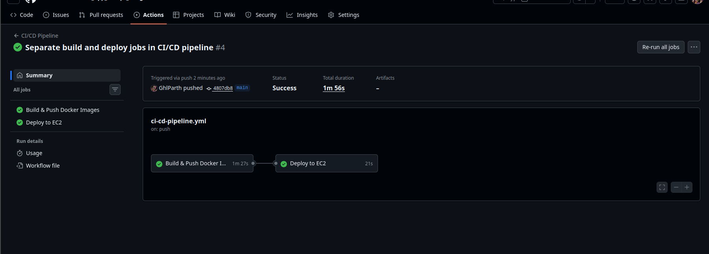
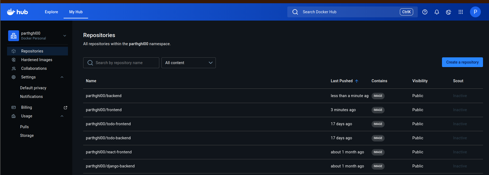
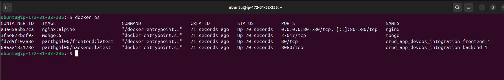
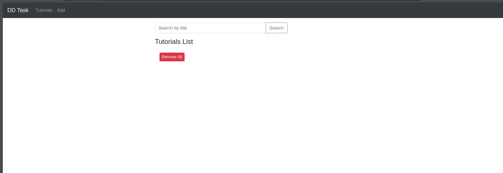

# MEAN CRUD App – DevOps Integration

This repository contains a **full-stack MEAN application** (MongoDB, Express, Angular, Node.js) with **Dockerized deployment, Nginx reverse proxy, and CI/CD automation** using GitHub Actions.

---

## 🗂 Repository Structure

```
CRUD_App_devops_integration/
│
├─ backend/        # Node.js + Express REST API
├─ frontend/       # Angular 15 frontend
├─ docker-compose.yml
├─ nginx/          # Nginx configuration
└─ README.md
```

---

## ⚙️ Prerequisites

* GitHub account
* Docker Hub account
* AWS EC2 instance (Ubuntu 24.04 recommended)
* SSH access to EC2
* Docker & Docker Compose installed on EC2
* GitHub Secrets set:

  * `DOCKER_USERNAME` – Docker Hub username
  * `DOCKER_PASSWORD` – Docker Hub password
  * `VM_IP` – EC2 public IP
  * `SSH_KEY` – Private key for EC2 login

---

## 🐳 Docker Setup

### 1️⃣ Backend Dockerfile

Located in `/backend`:

* Installs Node.js dependencies
* Exposes port `8080`
* Connects to MongoDB

### 2️⃣ Frontend Dockerfile

Located in `/frontend`:

* Installs Angular dependencies
* Builds production bundle
* Exposes port `80` for Nginx

### 3️⃣ Docker Compose

Located in `docker-compose.yml`:

---

## 🚀 Deployment on EC2

### 1️⃣ SSH into EC2

```bash
ssh -i <KEY.PEM> ubuntu@<EC2_PUBLIC_IP>
```

### 2️⃣ Pull & Start Containers

```bash
cd ~/CRUD_App_devops_integration

docker compose pull

docker compose down --remove-orphans

docker compose up -d
```

* Frontend: `http://<EC2_PUBLIC_IP>`
* Backend API: `http://<EC2_PUBLIC_IP>:8080/api/...`

---

## 🔄 CI/CD with GitHub Actions

* Workflow file: `.github/workflows/ci-cd.yml`
* **Two separate jobs:**

  1. **Build** – Build backend & frontend Docker images, push to Docker Hub
  2. **Deploy** – SSH to EC2, pull latest images, restart containers

### GitHub Secrets

| Secret Name       | Purpose                 |
| ----------------- | ----------------------- |
| `DOCKER_USERNAME` | Docker Hub username     |
| `DOCKER_PASSWORD` | Docker Hub password     |
| `VM_IP`           | EC2 public IP           |
| `SSH_KEY`         | Private SSH key for EC2 |

### Trigger

* Push to `main` branch triggers the workflow automatically.

---

## 🔹 Verify Deployment

1. Check containers:

```bash
docker ps
```

2. Open Angular app in browser:
   `http://<EC2_PUBLIC_IP>`

3. Trigger CI/CD:

   * Push a small change to GitHub
   * GitHub Actions rebuilds images and redeploys containers automatically

---

## 📷 Screenshots (for submission)

* 
* 
* 
* 

---

## 🔒 Notes

* MongoDB data is stored in a Docker volume (`mongo_data`)
* Nginx handles reverse proxy for frontend & backend
* Docker Compose handles multi-container orchestration
* EC2 security group should allow **port 22 (SSH) and 80 (HTTP)**

---

## ✅ Task Completed

* Full-stack MEAN app running in **Docker containers**
* **Nginx reverse proxy** configured
* **MongoDB database** working
* **CI/CD pipeline** fully automated using GitHub Actions
* Deployed on **AWS EC2 Ubuntu instance**

## 🤝 Let’s Connect

If you're a recruiter, engineer, or cloud enthusiast interested in DevOps and automation, feel free to connect with me.

- 💼 **[LinkedIn](www.linkedin.com/in/gohel-parth-a73625212)**
- 📧 **[Email](parthngohel004@gmail.com)**


## 👤 Author

**Parth Gohil**  
- [@Parth Gohel](https://github.com/GhlParth)
DevOps Engineer | Cloud | Automationg